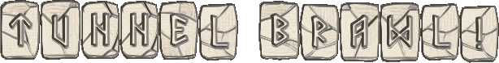

<p align="center">
  
</p>

<h1 align="center">Tunnel Brawl</h1>

<p align="center">
  A real-time, 2–4 player chess variant fought deep in the mines.<br/>
  Rival clans of dwarves brawl for contested tunnels — every move syncs live over WebSockets.
</p>

<p align="center">
  <strong>▶ Play it live: <a href="https://tunnelbrawl.timloughrist.com">tunnelbrawl.timloughrist.com</a></strong>
</p>

<p>Note that this is an older project that I recently updated so that I could run it live. The UI for login and such is a bit clunky...let's call it quirky.</p>

---

## Watch the demo

[](https://youtu.be/3sZGFw-KpPc)

*Click the image to watch a walkthrough of the app.* Or [play the live version](https://tunnelbrawl.timloughrist.com) — or [run it locally](#running-locally).

## About

Deep underground, rival clans of dwarves expand their tunnels in search of gems and precious metals. When their tunnels collide, the whole clan mobilizes — and an all-out melee ensues: a **Tunnel Brawl**.

The game was originally designed by **Mark Alan Osterhaus** and published as *Bosworth* in the U.S. and *Waterloo* in Europe. This online adaptation cleaves as close to the original rules as possible and is played **synchronously** — two to four players share one board and see each other's moves in real time.

Each player commands a clan of eight pawns, two rooks, two knights, two bishops, a queen, and a king. You start with four pawns at your tunnel mouth and reinforcements in reserve. **The game ends when only one king remains.**

## Tech stack

| Layer | Technology |
|------|------------|
| Frontend | React 18 + React Router, built with **Vite**; `@rails/actioncable` client |
| Backend | **Ruby on Rails 8** (Ruby 3.4), API-only |
| Real-time | Action Cable over WebSockets, backed by **Solid Cable** (PostgreSQL — no Redis) |
| Background jobs | **Solid Queue** (PostgreSQL), run in-process with Puma |
| Database | PostgreSQL (Supabase in production) |
| Auth | Cookie-based sessions with `bcrypt` (`has_secure_password`) |
| Deploy (production) | ECS Fargate + ALB (API) · S3/CloudFront (SPA) · Supabase Postgres · CDK IaC |

### Architecture

```
React SPA  ──REST (fetch, cookie session)──►  Rails 8 API  ──►  PostgreSQL
    ▲                                              │
    └────────── Action Cable / WebSocket ──────────┘   (live board updates via Solid Cable)
```

This is a monorepo:

```
tunnelbrawl/
├── backend/    # Rails 8 API — game engine, Action Cable channel, Solid Queue jobs
└── frontend/   # Vite + React SPA — board UI, real-time client
```

## Running locally

### Prerequisites
- **Ruby 3.4.x** (a `.ruby-version` is pinned; [rbenv](https://github.com/rbenv/rbenv) recommended)
- **PostgreSQL** 14+
- **Node 20+** (see `frontend/.nvmrc`)

### Backend (`backend/`)
```bash
cd backend
bundle install
bin/rails db:create db:migrate
bin/rails server -p 3000
```
Point Rails at your database with the standard `DATABASE_URL`, or `PGHOST`/`PGPORT` (the dev config defaults to port **5433** — override `PGPORT=5432` if your Postgres uses the default). Solid Queue runs inside Puma when `SOLID_QUEUE_IN_PUMA=true` (used in production).

### Frontend (`frontend/`)
```bash
cd frontend
npm install
npm run dev          # serves on http://localhost:4000
```
The API base URL is read from `VITE_API_URL` (see `.env.development`, which defaults to `http://localhost:3000`).

Then open **http://localhost:4000**, sign up, and either **Create New Game** or join one from the **Taproom**. To try multiplayer locally, open a second account in an incognito window.

## How to play

- **Create a game:** on the **Games** page, click **Create New Game**.
- **Join a game:** on the **Taproom** page, pick an open game. It starts when the host clicks **Start Game**.
- Each turn has two phases: **move** a piece on the board, then **place** reinforcements from your reserve into any open squares of your tunnel mouth.
- You can leave a game before it starts, and cancel your own game at any time.

<details>
<summary><strong>Full rules — setup, pieces, and special rules</strong></summary>

### Setup

**Two players** — Red and Blue start opposite each other at the eastern and western tunnel mouths. North and south are blocked.

**Three players** — Red (west), Green (north), and Blue (east). The southern tunnel mouth is blocked.

**Four players** — Red, Green, Blue, and Yellow, with Yellow occupying the southern tunnel mouth.

### Moving and capturing

**Pawns** — the backbone of the clan (eight per clan, four start at your tunnel mouth). Move forward or sideways, but never backward (toward your tunnel mouth). One square at a time, except the first move, which may be up to two squares (and can't jump a piece). Capture diagonally — including diagonally *behind* — replacing the enemy piece. No en passant and no promotion.

**Rooks** — the bruisers. Move any number of squares forward, backward, or sideways (not diagonally); can't jump pieces. Capture by moving onto an enemy piece. No castling.

**Knights** — high-mobility. Move in an "L" (two steps then one perpendicular), ignoring pieces in between; can't land on a friendly piece. Capture by landing on an enemy piece.

**Bishops** — slip through the stone. Move diagonally any number of squares, forward or backward; can't jump pieces. Capture by moving onto an enemy piece.

**Queens** — the warrior-queen. Move any number of squares in any direction; can't jump pieces. Capture by moving onto an enemy piece.

**Kings** — slow but mighty. Move one square in any direction. Capture by moving onto an enemy piece, and may even capture one of their *own* pieces (e.g. to escape check). **If a king is captured, that clan's pieces are removed from the board and that player is out.**

### Special rules

**Tunnel collapse** — if a player has no reserves left, their tunnel mouth collapses: empty squares are blocked with rubble, and occupied squares are blocked as soon as they empty. The same happens if a player's king is captured.

**Queen defection** — when you capture a king, the losing clan's queen defects to *your* clan (even if she'd already been captured). A new queen appears in an open square of your tunnel mouth — as soon as one is available if it's currently full or collapsed.

**Locking** — if a player has no legal move, they forfeit the move phase of their turn. If their tunnel mouth is completely occupied, they forfeit the placement phase.

</details>

## Modernization notes

This project began in early 2023 as a Flatiron School capstone (originally two repos: a Rails 7 / Ruby 3.0 API and a Create React App frontend). It has since been brought up to date:

- **Rails 7.0 → 8.0** and **Ruby 3.0 → 3.4**.
- **Dropped Redis and Sidekiq** in favor of Rails 8's Postgres-backed **Solid Cable** (Action Cable) and **Solid Queue** (Active Job) — one fewer service to run.
- **Create React App → Vite**, with the API host centralized into an environment variable.
- **Consolidated two repos into one monorepo.**
- A pass over the game engine and API hardened move validation (server-side turn enforcement), closed mass-assignment holes, added real-time broadcasts on join/leave, and fixed a batch of latent gameplay bugs.

## Roadmap

- Friends list and private games
- Asynchronous games with email notifications
- In-app messaging and profile pictures

*Automatic cleanup of never-started games is already implemented (a Solid Queue job removes still-pending games after a couple of minutes).*

## Credits

- Original game design: **Mark Alan Osterhaus** (*Bosworth* / *Waterloo*).
- Artwork by **Kat Morrow**.
- With thanks to the instructors at the [Flatiron School](https://flatironschool.com/) and to everyone who's played board games with me over the years.

## Contact

Questions or suggestions? Email **tim.loughrist@gmail.com**. Forks and experiments welcome.
